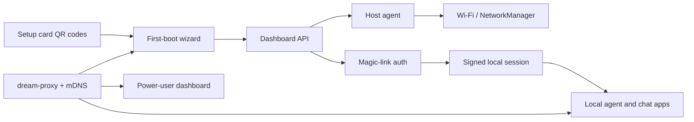

# Dream Server Drop Ship (DS2)

Gamma.ai source outline for an AMD-facing DS2 feature deck.

This brief keeps the public product story hardware-neutral while using AMD
hardware as the concrete opportunity. Strix Halo is the flagship showcase, but
the higher-volume opportunity is AMD mini PCs and small-form-factor systems in
the Mac mini price bracket.

The DS2 feature is deployed in the Dream Server codebase and tested in pieces,
but it still needs complete end-to-end validation on packaged target hardware
before it should be described as production-ready appliance onboarding.

## Slide 1: The End State

**Secure AMD-powered local AI, chatting in minutes**

Dream Server Drop Ship (DS2) lets an AMD local AI box arrive preinstalled. The
user powers it on, scans a QR code, joins Wi-Fi, and starts using local AI apps
such as Hermes Agent, OpenClaw where enabled, Open WebUI, voice, workflows, and
other Dream Server services.

No monitor. No SSH. No hunting for IP addresses. Scan, connect, chat.

## Slide 2: What Dream Server Is

Dream Server is the local AI app layer for AMD hardware: a local-first AI stack
that bundles inference, chat, agents, voice, workflows, RAG, privacy tools,
dashboards, and extensions onto user-owned hardware.

DS2 adds the missing appliance experience: a preinstalled device can be handed
to a non-technical user and activated from a phone.

- Local inference and services run on the user's hardware.
- AMD acceleration powers the local model backend where supported.
- Users get familiar app surfaces, not just ports and containers.
- Power users still get the dashboard, telemetry, model controls, diagnostics,
  and service management.
- Non-technical users can go straight to chat and agent workflows.

## Slide 3: The Problem

Local AI hardware is powerful, but setup still feels like a developer workflow.

- Many AI-capable devices ship without a permanent monitor or keyboard.
- Users may not know the device IP address, host name, service ports, or admin
  credentials.
- Wi-Fi setup, local discovery, authentication, and chat access are usually
  separate chores.
- A great AMD hardware story can lose momentum if the first-run experience
  starts with SSH, logs, and network debugging.

## Slide 4: The Opportunity

Make local AI hardware feel like opening a useful device, not configuring a
server.

- A vendor, reseller, lab, or friend can preinstall Dream Server.
- The recipient can complete setup from a phone, laptop, tablet, or TV.
- The first experience can be a useful local agent, not a terminal.
- Dream Server keeps the system open for builders while making it approachable
  for everyday users.

## Slide 5: Two AMD Opportunities

**Strix Halo is the showcase. Mac mini-class AMD boxes are the volume play.**

Strix Halo showcase:

- Premium local AI demo platform.
- Strong story around memory, small form factor, and serious local models.
- Great for creators, labs, developers, and high-end local AI appliances.

Mac mini price-bracket volume:

- Higher potential unit volume.
- Familiar small desktop footprint.
- Strong fit for home, office, classroom, and small business local AI.
- Competes on private local AI usefulness, not only raw benchmark charts.

## Slide 6: The DS2 Solution

Dream Server connects first-run setup, local discovery, authentication, and app
access.

- Printed setup card with Wi-Fi and setup URL QR codes.
- Optional first-boot access point for machines not already on a network.
- Mobile-friendly setup wizard.
- Host-side Wi-Fi scan and connect actions.
- Local mDNS names such as `dashboard.dream.local`, `chat.dream.local`, and
  `hermes.dream.local`.
- Magic-link invite QR that gives the first user an authenticated local session.
- Agent and chat surfaces behind Dream Server session auth.

## Slide 7: User Journey

1. Power on the preinstalled AMD device.
2. Scan the setup card QR code.
3. Join the setup AP or open the local setup URL.
4. Pick a Wi-Fi network from the first-boot wizard.
5. Scan the invite QR.
6. Land in a local chat or agent experience.
7. Open the dashboard later for models, services, telemetry, and diagnostics.

## Slide 8: Architecture

## Slide 9: Code Proof Points

- Setup card QR generation:
  <https://github.com/Light-Heart-Labs/DreamServer/blob/main/dream-server/scripts/generate-setup-card.py#L51>
- First-boot wizard:
  <https://github.com/Light-Heart-Labs/DreamServer/blob/main/dream-server/extensions/services/dashboard/src/pages/FirstBoot.jsx#L80>
- Setup and Wi-Fi API:
  <https://github.com/Light-Heart-Labs/DreamServer/blob/main/dream-server/extensions/services/dashboard-api/routers/setup.py#L315>
- Host-side Wi-Fi control:
  <https://github.com/Light-Heart-Labs/DreamServer/blob/main/dream-server/bin/dream-host-agent.py#L1216>
- Magic-link QR and redemption:
  <https://github.com/Light-Heart-Labs/DreamServer/blob/main/dream-server/extensions/services/dashboard-api/routers/magic_link.py#L382>
- First-boot AP mode:
  <https://github.com/Light-Heart-Labs/DreamServer/blob/main/dream-server/scripts/ap-mode.sh#L2>
- LAN discovery:
  <https://github.com/Light-Heart-Labs/DreamServer/blob/main/dream-server/bin/dream-mdns.py#L4>
- Local reverse proxy:
  <https://github.com/Light-Heart-Labs/DreamServer/blob/main/dream-server/extensions/services/dream-proxy/Caddyfile#L65>
- Hermes authenticated entry path:
  <https://github.com/Light-Heart-Labs/DreamServer/blob/main/dream-server/extensions/services/hermes-proxy/Caddyfile#L1>
- OpenClaw integration:
  <https://github.com/Light-Heart-Labs/DreamServer/blob/main/dream-server/docs/OPENCLAW-INTEGRATION.md>

## Slide 10: Demo Plan

Show the Strix Halo demo, then show the volume path.

- Start with the Strix Halo device powered on and no monitor attached.
- Scan the setup card from a phone.
- Open the first-boot wizard.
- Join Wi-Fi or confirm existing LAN connectivity.
- Scan the magic-link invite QR.
- Chat with a local agent or chat app from the phone or laptop.
- Open the dashboard to show local services, model status, and controls.
- Close by showing that the same DS2 flow can ship on lower-cost AMD mini PCs.

## Slide 11: What Still Needs Validation

The code is present; packaged appliance images need end-to-end validation.

- End-to-end setup on the exact Strix Halo image.
- End-to-end setup on one or more Mac mini-class AMD mini PC images.
- Wi-Fi adapter AP-mode compatibility.
- NetworkManager behavior across target Linux distributions.
- mDNS behavior across common phone, laptop, router, and VPN environments.
- Agent/chat auth handoff through the proxy on packaged images.
- Recovery path when the user changes networks or loses the setup card.

## Slide 12: Feature Rollout Paths

DS2 turns preinstalled AMD systems into ready-to-use local AI appliances.

- Premium Strix Halo showcase: demonstrate full monitorless setup,
  AMD-accelerated local inference, and local agent/chat surfaces.
- Mac mini-class AMD volume device: use the same QR onboarding flow on
  lower-cost small-form-factor systems.
- Retail or reseller handoff: preinstall Dream Server, include the setup card,
  and let the recipient activate the device from a phone.
- Lab, classroom, and office deployment: ship configured local AI boxes without
  requiring each recipient to connect a monitor.
- Marketplace-ready story: once validation is complete, Dream Server can be
  presented as a local AI app stack that makes AMD hardware immediately useful
  to non-technical users.

## Slide 13: Repo Reference

Use full GitHub URLs. Do not convert them into relative links.

- Dream Server repo:
  <https://github.com/Light-Heart-Labs/DreamServer>
- Hardware-neutral DS2 / headless setup doc:
  <https://github.com/Light-Heart-Labs/DreamServer/blob/main/dream-server/docs/HEADLESS-SETUP.md>
- Setup card operator doc:
  <https://github.com/Light-Heart-Labs/DreamServer/blob/main/dream-server/docs/SETUP-CARD.md>
- Hermes integration:
  <https://github.com/Light-Heart-Labs/DreamServer/blob/main/dream-server/docs/HERMES.md>
- Hermes SSO:
  <https://github.com/Light-Heart-Labs/DreamServer/blob/main/dream-server/docs/HERMES-SSO.md>
- OpenClaw integration:
  <https://github.com/Light-Heart-Labs/DreamServer/blob/main/dream-server/docs/OPENCLAW-INTEGRATION.md>
- AP mode:
  <https://github.com/Light-Heart-Labs/DreamServer/blob/main/dream-server/docs/AP-MODE.md>
- Local proxy:
  <https://github.com/Light-Heart-Labs/DreamServer/blob/main/dream-server/docs/DREAM-PROXY.md>
- mDNS:
  <https://github.com/Light-Heart-Labs/DreamServer/blob/main/dream-server/docs/MDNS.md>

## Closing Message

Dream Server Drop Ship (DS2) turns AMD local AI hardware into something a
non-technical user can actually receive, activate, and use. Strix Halo can prove
the premium experience; Mac mini-class AMD systems can scale the volume
opportunity.
